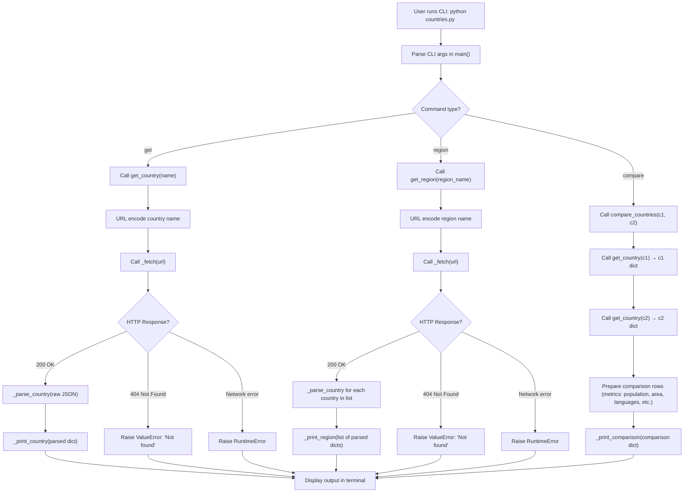

# countries.py

A clean Python wrapper around the [REST Countries v3.1 API](https://restcountries.com).
Zero dependencies — uses the standard library only.

## What it does

| Function | Description |
|---|---|
| `get_country(name)` | Fetch a single country by common or official name |
| `get_region(region_name)` | Fetch all countries in a region, sorted by population |
| `compare_countries(c1, c2)` | Side-by-side comparison of two countries |

All three functions return plain Python dicts/lists and raise `ValueError` for unknown
names or `RuntimeError` for network failures — no framework-specific exceptions.

## How to run

Python 3.10+ required. No `pip install` needed.

```bash
# Single country
python countries.py get Japan

# All countries in a region (Africa · Americas · Asia · Europe · Oceania)
python countries.py region Europe

# Side-by-side comparison
python countries.py compare Pakistan India
python countries.py compare "United States" Canada
```

Use it as a module too:

```python
from countries import get_country, get_region, compare_countries

japan = get_country("Japan")
print(japan["population"])   # 125836021

top5_asia = get_region("Asia")[:5]

result = compare_countries("Pakistan", "India")
for row in result["comparison"]:
    print(row["metric"], "|", row["c1"], "|", row["c2"])
```

## Example output

### `python countries.py get Japan`

```
──────────────────────────────────────────────────
  🇯🇵  Japan
──────────────────────────────────────────────────
  Official Name        Japan
  Capital              Tokyo
  Region               Asia › Eastern Asia
  Population           125,836,021
  Area                 377,930 km²
  Languages            Japanese
  Currencies           JPY (Japanese yen)
  Top-Level Domain     .jp
  Timezones            UTC+09:00
  Borders              CHN, PRK, KOR, RUS
```

### `python countries.py region Europe`  *(top 5 of 44 shown)*

```
  Region: Europe  (44 countries)

  Country                          Population     Area (km²)  Languages
  ─────────────────────────────────────────────────────────────────────────────────
  Russia                          144,104,080    17,098,242  Russian
  Germany                          83,240,525       357,114  German
  France                           67,391,582       551,695  French
  United Kingdom                   67,215,293       242,900  English
  Italy                            59,554,023       301,336  Italian
```

### `python countries.py compare Pakistan India`

```
                              COUNTRY COMPARISON
  ┼────────────────────┼──────────────────────────────┼───────────────────────────────────────────────────────────────────────────────────────────────────────────────┼
  │ Metric             │ 🇵🇰 Pakistan                  │ 🇮🇳 India                                                                                                      │
  ┼────────────────────┼──────────────────────────────┼───────────────────────────────────────────────────────────────────────────────────────────────────────────────┼
  │ Official Name      │ Islamic Republic of Pakistan │ Republic of India                                                                                             │
  │ Capital            │ Islamabad                    │ New Delhi                                                                                                     │
  │ Region / Subregion │ Asia / Southern Asia         │ Asia / Southern Asia                                                                                          │
  │ Population         │ 220,892,340                  │ 1,380,004,385                                                                                                 │
  │ Area               │ 881,912 km²                  │ 3,287,590 km²                                                                                                 │
  │ Languages          │ English, Urdu                │ English, Hindi, Bengali, Gujarati, Kannada, Malayalam, Marathi, Oriya, Punjabi, Sanskrit, Tamil, Telugu, Urdu │
  │ Currencies         │ PKR (Pakistani rupee)        │ INR (Indian rupee)                                                                                            │
  │ Timezones          │ UTC+05:00                    │ UTC+05:30                                                                                                     │
  │ Border Countries   │ AFG, CHN, IND, IRN           │ BGD, BTN, CHN, MMR, NPL, PAK                                                                                  │
  ┼────────────────────┼──────────────────────────────┼───────────────────────────────────────────────────────────────────────────────────────────────────────────────┼
```

### Error case

```
  ✗  Country not found: 'Narnia'
```

## Error handling

| Situation | Exception raised |
|---|---|
| Country / region not found (HTTP 404) | `ValueError` |
| Network failure, DNS error, timeout | `RuntimeError` |
| Any other HTTP error | `RuntimeError` |

The CLI catches both and prints a clean `✗` message with a non-zero exit code.
Callers using the module API receive the raw exception to handle as they see fit.

## Data source

All data is live from [restcountries.com](https://restcountries.com) v3.1.
Population and area figures reflect whatever the API returns at call time.
GDP per capita is not available from this API.

## Mermaid


